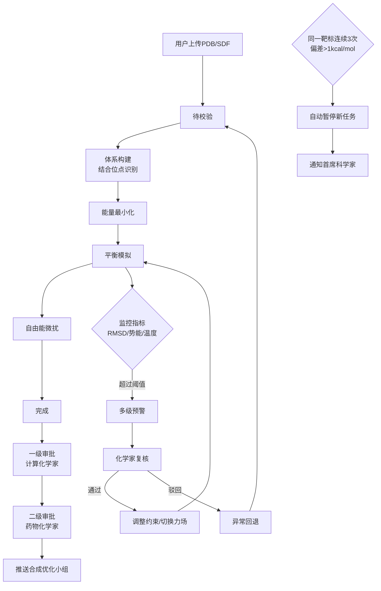

## 1. 产品概述

本平台是面向药物研发领域的高精度蛋白质-配体结合自由能预测与先导化合物优化平台，集成分子动力学模拟、自由能计算和智能推荐引擎，为计算化学家和药物化学家提供端到端的虚拟筛选与化合物优化解决方案。

- **核心目标**：实现高精度的结合自由能预测（误差 < 1 kcal/mol），加速先导化合物发现与优化流程
- **目标用户**：计算化学家、药物化学家、合成优化小组、首席科学家
- **核心价值**：自动化分子模拟流程、智能预警与质量控制、多级审批确保预测可靠性、数据驱动的方法推荐

## 2. 核心功能

### 2.1 用户角色

| 角色 | 注册方式 | 核心权限 |
|------|----------|----------|
| 计算化学家 | 管理员创建 | 上传分子文件、配置模拟参数、监控模拟进程、处理预警、复核异常、提交一级审批 |
| 药物化学家 | 管理员创建 | 查看模拟结果、确认预测可靠性、提交二级审批、推送至合成小组 |
| 合成优化小组 | 管理员创建 | 查看获批的模拟结果、下载合成方案 |
| 首席科学家 | 管理员创建 | 查看全局统计、处理靶标暂停通知、系统配置管理 |
| 系统管理员 | 管理员创建 | 用户管理、权限配置、系统监控 |

### 2.2 功能模块

1. **任务管理**：模拟任务创建、文件上传（PDB/SDF）、参数配置、任务列表、任务详情
2. **模拟引擎**：结合位点识别、复合物构建、力场初始化、能量最小化、平衡模拟、自由能微扰
3. **实时监控**：RMSD曲线、势能监控、温度监控、预警推送、异常处理
4. **审批流程**：一级审批（计算化学家）、二级审批（药物化学家）、审批记录
5. **报告生成**：自由能分解图、RMSD曲线、相互作用指纹、结合模式快照、综合PDF报告
6. **智能推荐**：计算方法推荐（TI/FEP/MM-PBSA）、采样策略推荐、历史数据分析
7. **靶标管理**：靶标信息管理、偏差监控、自动暂停机制
8. **综合看板**：模拟完成率统计、预测误差分析、资源消耗统计、性能趋势图、精度箱图

### 2.3 页面详情

| 页面名称 | 模块名称 | 功能描述 |
|----------|----------|----------|
| 登录页 | 身份验证 | 用户名密码登录、角色权限识别 |
| 仪表盘 | 综合看板 | 任务概览、完成率统计、误差趋势、资源消耗、预警列表 |
| 任务列表 | 任务管理 | 任务筛选、状态查看、批量操作、新建任务入口 |
| 新建任务 | 任务创建 | PDB/SDF文件上传、结合位点设置、力场选择、模拟参数配置 |
| 任务详情 | 模拟监控 | 状态流转图、实时监控曲线、预警信息、调整日志、审批按钮 |
| 预警中心 | 异常处理 | 预警列表、预警详情、复核操作、参数调整记录 |
| 审批中心 | 流程审批 | 待审批列表、审批详情、通过/驳回操作 |
| 报告中心 | 结果查看 | 报告列表、PDF预览、轨迹数据导出、自由能分量导出 |
| 智能推荐 | 方法选择 | 历史数据展示、推荐算法说明、方法对比、采样策略建议 |
| 靶标管理 | 靶标监控 | 靶标列表、偏差统计、暂停/恢复操作、通知记录 |
| 统计看板 | 数据分析 | 日度统计报表、性能趋势图、精度箱图、资源消耗分析 |
| 用户管理 | 权限控制 | 用户列表、角色分配、权限配置 |

## 3. 核心流程

### 3.1 模拟任务主流程

用户上传PDB蛋白质文件和SDF配体文件，系统自动识别结合位点并构建复合物，依次经过体系构建、能量最小化、平衡模拟、自由能微扰等阶段，实时监控RMSD、势能和温度，异常时触发预警，完成后生成报告并进入两级审批。

### 3.2 状态流转机制

模拟任务包含7个核心状态，支持自动流转和异常回退：
- 待校验 → 体系构建 → 能量最小化 → 平衡模拟 → 自由能微扰 → 完成
- 任意阶段异常 → 异常回退 → 待校验

## 4. 用户界面设计

### 4.1 设计风格

**科技精准风（Scientific Precision）**
- **主色调**：深邃科技蓝 `#0F172A` 作为背景，体现专业与严谨
- **强调色**：量子青 `#06B6D4` 用于交互元素和数据高亮，荧光绿 `#10B981` 表示正常状态，警示橙 `#F59E0B` 和危险红 `#EF4444` 用于预警分级
- **中性色**： slate 色系构建层次分明的信息架构
- **字体**：展示字体使用 `Space Grotesk` 体现科技感，正文字体使用 `Inter` 确保可读性，等宽字体 `JetBrains Mono` 用于数据和代码展示
- **视觉元素**：分子结构线框、数据可视化图表、科技感网格背景、微秒级过渡动画

### 4.2 页面设计概览

| 页面名称 | 模块名称 | UI元素 |
|----------|----------|--------|
| 登录页 | 身份验证 | 全屏分子结构动效背景、玻璃态登录卡片、渐变按钮、输入框浮动标签 |
| 仪表盘 | 综合看板 | 数据卡片网格、实时趋势图、预警滚动列表、分子结构3D预览、快速操作区 |
| 任务列表 | 任务管理 | 高级筛选栏、状态标签色标、进度条、批量操作工具栏、分页器 |
| 新建任务 | 任务创建 | 分步向导（文件上传→参数配置→确认提交）、拖拽上传区、实时参数校验 |
| 任务详情 | 模拟监控 | 状态流转时间轴、实时监控图表（RMSD/势能/温度）、预警时间线、调整日志 |
| 预警中心 | 异常处理 | 分级预警卡片、预警详情抽屉、复核操作面板、参数调整对比 |
| 审批中心 | 流程审批 | 审批工作流图、对比视图（原始vs调整）、审批意见编辑器、数字签名 |
| 报告中心 | 结果查看 | PDF预览器、图表交互区、数据导出面板、版本对比 |
| 智能推荐 | 方法选择 | 方法对比雷达图、历史数据热力图、推荐解释面板、策略选择器 |
| 统计看板 | 数据分析 | 多维度统计图表、时间轴选择器、精度箱图、资源消耗堆叠图 |

### 4.3 响应式设计

- **桌面端优先**：针对1920×1080及以上分辨率优化，多面板布局充分利用屏幕空间
- **平板适配**：1024px断点，侧边栏可折叠，图表自适应缩放
- **移动适配**：768px断点，单列布局，核心功能优先展示，次要功能折叠

### 4.4 3D分子可视化

- **渲染引擎**：使用 3Dmol.js 实现高性能分子结构渲染
- **环境设置**：深色背景配合高光效果，突出分子空间结构
- **光照系统**：三点光源设置，主光+补光+轮廓光，增强立体感
- **交互方式**：鼠标拖拽旋转、滚轮缩放、点击选择残基/配体
- **显示模式**：支持卡通、球棍、空间填充、表面等多种显示模式切换
- **结合位点**：半透明表面高亮显示，配体以醒目颜色区分
