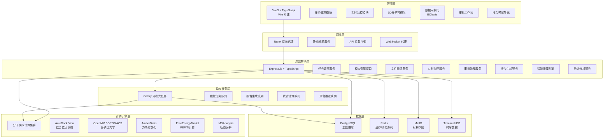
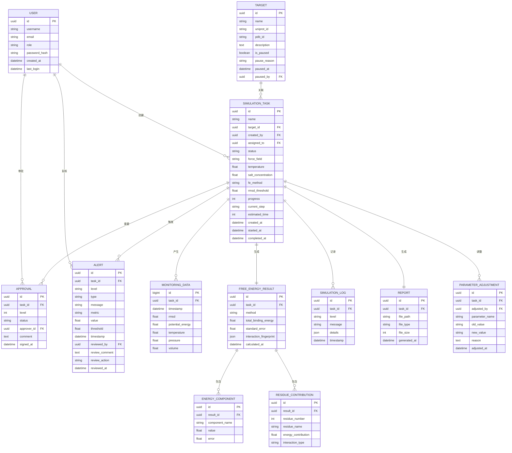

## 1. 架构设计



## 2. 技术描述

- **前端**：Vue3 + TypeScript + Vite + Pinia + Vue Router + TailwindCSS + ECharts + 3Dmol.js
- **后端**：Express.js + TypeScript + Socket.io + BullMQ
- **数据库**：PostgreSQL 15 + Redis 7 + TimescaleDB 2 + MinIO
- **计算引擎**：OpenMM、GROMACS、AmberTools、AutoDock Vina、MDAnalysis
- **任务调度**：Celery 5 + Redis Broker
- **PDF生成**：jsPDF + html2canvas + Puppeteer
- **部署方式**：Docker + Docker Compose + Nginx

## 3. 路由定义

| 路由 | 页面 | 权限要求 |
|------|------|----------|
| /login | 登录页 | 公开 |
| /dashboard | 仪表盘 | 所有登录用户 |
| /tasks | 任务列表 | 计算化学家/药物化学家 |
| /tasks/new | 新建任务 | 计算化学家 |
| /tasks/:id | 任务详情 | 计算化学家/药物化学家 |
| /alerts | 预警中心 | 计算化学家 |
| /approvals | 审批中心 | 计算化学家/药物化学家 |
| /reports | 报告中心 | 计算化学家/药物化学家/合成小组 |
| /recommendations | 智能推荐 | 计算化学家 |
| /targets | 靶标管理 | 首席科学家/计算化学家 |
| /statistics | 统计看板 | 首席科学家/管理员 |
| /users | 用户管理 | 管理员 |

## 4. API 定义

### 4.1 TypeScript 类型定义

```typescript
// 任务状态枚举
enum SimulationStatus {
  PENDING_VALIDATION = 'pending_validation',
  SYSTEM_BUILDING = 'system_building',
  ENERGY_MINIMIZATION = 'energy_minimization',
  EQUILIBRATION = 'equilibration',
  FEP_CALCULATION = 'fep_calculation',
  COMPLETED = 'completed',
  ERROR_ROLLBACK = 'error_rollback'
}

// 预警级别
enum AlertLevel {
  INFO = 'info',
  WARNING = 'warning',
  CRITICAL = 'critical',
  FATAL = 'fatal'
}

// 审批状态
enum ApprovalStatus {
  PENDING = 'pending',
  APPROVED = 'approved',
  REJECTED = 'rejected'
}

// 自由能计算方法
enum FEMethod {
  FEP = 'fep',
  TI = 'ti',
  MMPBSA = 'mmpbsa'
}

interface SimulationTask {
  id: string;
  name: string;
  targetId: string;
  proteinFile: FileInfo;
  ligandFile: FileInfo;
  status: SimulationStatus;
  forceField: string;
  temperature: number;
  saltConcentration: number;
  feMethod: FEMethod;
  bindingSite: BindingSite;
  rmsdThreshold: number;
  progress: number;
  currentStep: string;
  estimatedTime: number;
  createdAt: Date;
  createdBy: User;
  assignedTo: User;
}

interface MonitoringData {
  timestamp: Date;
  taskId: string;
  rmsd: number;
  potentialEnergy: number;
  temperature: number;
  pressure: number;
  volume: number;
}

interface Alert {
  id: string;
  taskId: string;
  level: AlertLevel;
  type: string;
  message: string;
  metric: string;
  value: number;
  threshold: number;
  timestamp: Date;
  reviewedBy?: User;
  reviewComment?: string;
  reviewAction?: string;
  reviewedAt?: Date;
}

interface FreeEnergyResult {
  taskId: string;
  method: FEMethod;
  totalBindingEnergy: number;
  standardError: number;
  energyComponents: EnergyComponent[];
  decompositionPerResidue: ResidueContribution[];
  interactionFingerprint: InteractionFingerprint;
}

interface Approval {
  id: string;
  taskId: string;
  level: number;
  status: ApprovalStatus;
  approver: User;
  comment: string;
  signedAt: Date;
}
```

### 4.2 RESTful API 接口

| 方法 | 路径 | 描述 | 请求参数 | 响应 |
|------|------|------|----------|------|
| POST | /api/auth/login | 用户登录 | {username, password} | {token, user} |
| GET | /api/tasks | 获取任务列表 | {page, size, status, target} | {items, total} |
| POST | /api/tasks | 创建模拟任务 | {name, targetId, forceField, ...} | {taskId} |
| GET | /api/tasks/:id | 获取任务详情 | id | SimulationTask |
| GET | /api/tasks/:id/monitoring | 获取监控数据 | {startTime, endTime} | MonitoringData[] |
| GET | /api/tasks/:id/alerts | 获取任务预警 | | Alert[] |
| POST | /api/tasks/:id/alerts/:alertId/review | 复核预警 | {action, comment} | |
| GET | /api/tasks/:id/result | 获取计算结果 | | FreeEnergyResult |
| POST | /api/tasks/:id/report | 生成报告 | {format} | {reportUrl} |
| POST | /api/approvals/:id | 提交审批 | {status, comment} | |
| GET | /api/recommendations | 获取方法推荐 | {targetId, ligandType} | {method, confidence, reason} |
| GET | /api/statistics/daily | 日度统计 | {date} | DailyStats |
| GET | /api/targets | 靶标列表 | | Target[] |
| POST | /api/targets/:id/pause | 暂停靶标 | {reason} | |

### 4.3 WebSocket 事件

| 事件 | 描述 | 数据 |
|------|------|------|
| task:status | 任务状态更新 | {taskId, status, progress} |
| task:monitoring | 实时监控数据 | MonitoringData |
| task:alert | 新预警通知 | Alert |
| approval:new | 新审批请求 | Approval |

## 5. 服务器架构图

```mermaid
graph TD
    subgraph "接口层 Controllers"
        C1["AuthController"]
        C2["TaskController"]
        C3["MonitoringController"]
        C4["AlertController"]
        C5["ApprovalController"]
        C6["ReportController"]
        C7["RecommendationController"]
        C8["StatisticsController"]
        C9["TargetController"]
        C10["UserController"]
    end
    
    subgraph "服务层 Services"
        S1["AuthService"]
        S2["TaskService"]
        S3["SimulationEngineService"]
        S4["MonitoringService"]
        S5["AlertService"]
        S6["ApprovalService"]
        S7["ReportService"]
        S8["RecommendationEngine"]
        S9["StatisticsService"]
        S10["FileProcessingService"]
        S11["NotificationService"]
    end
    
    subgraph "数据访问层 Repositories"
        R1["UserRepository"]
        R2["TaskRepository"]
        R3["MonitoringRepository"]
        R4["AlertRepository"]
        R5["ApprovalRepository"]
        R6["ReportRepository"]
        R7["TargetRepository"]
        R8["SimulationLogRepository"]
    end
    
    subgraph "基础设施"
        DB1["PostgreSQL"]
        DB2["Redis Cache"]
        DB3["TimescaleDB"]
        ST1["MinIO Object Storage"]
        MQ1["BullMQ Job Queue"]
        WS1["Socket.io"]
    end
    
    C1 --> S1 --> R1 --> DB1
    C2 --> S2 --> R2 --> DB1
    C3 --> S4 --> R3 --> DB3
    C4 --> S5 --> R4 --> DB1
    C5 --> S6 --> R5 --> DB1
    C6 --> S7 --> R6 --> DB1
    C7 --> S8 --> R2
    C8 --> S9 --> R3 --> DB3
    C9 --> R7 --> DB1
    C10 --> R1 --> DB1
    
    S2 --> S3 --> MQ1
    S3 --> S10 --> ST1
    S4 --> WS1
    S5 --> S11
    S6 --> S11
    S7 --> ST1
```



## 6. 数据模型

### 6.1 ER 图



### 6.2 DDL 语句

```sql
-- 扩展启用
CREATE EXTENSION IF NOT EXISTS "uuid-ossp";
CREATE EXTENSION IF NOT EXISTS timescaledb;

-- 用户表
CREATE TABLE users (
    id UUID PRIMARY KEY DEFAULT uuid_generate_v4(),
    username VARCHAR(50) UNIQUE NOT NULL,
    email VARCHAR(100) UNIQUE NOT NULL,
    role VARCHAR(20) NOT NULL CHECK (role IN ('computational_chemist', 'medicinal_chemist', 'synthesis_team', 'chief_scientist', 'admin')),
    password_hash VARCHAR(255) NOT NULL,
    created_at TIMESTAMPTZ DEFAULT CURRENT_TIMESTAMP,
    last_login TIMESTAMPTZ
);

-- 靶标表
CREATE TABLE targets (
    id UUID PRIMARY KEY DEFAULT uuid_generate_v4(),
    name VARCHAR(100) NOT NULL,
    uniprot_id VARCHAR(20),
    pdb_id VARCHAR(10),
    description TEXT,
    is_paused BOOLEAN DEFAULT FALSE,
    pause_reason TEXT,
    paused_at TIMESTAMPTZ,
    paused_by UUID REFERENCES users(id)
);

-- 模拟任务表
CREATE TABLE simulation_tasks (
    id UUID PRIMARY KEY DEFAULT uuid_generate_v4(),
    name VARCHAR(200) NOT NULL,
    target_id UUID REFERENCES targets(id),
    created_by UUID REFERENCES users(id),
    assigned_to UUID REFERENCES users(id),
    status VARCHAR(30) NOT NULL DEFAULT 'pending_validation',
    force_field VARCHAR(50) NOT NULL,
    temperature FLOAT NOT NULL DEFAULT 300.0,
    salt_concentration FLOAT NOT NULL DEFAULT 0.15,
    fe_method VARCHAR(20) NOT NULL DEFAULT 'fep',
    rmsd_threshold FLOAT NOT NULL DEFAULT 2.0,
    progress INTEGER DEFAULT 0,
    current_step VARCHAR(100),
    estimated_time INTEGER,
    protein_file_path VARCHAR(500),
    ligand_file_path VARCHAR(500),
    binding_site JSONB,
    created_at TIMESTAMPTZ DEFAULT CURRENT_TIMESTAMP,
    started_at TIMESTAMPTZ,
    completed_at TIMESTAMPTZ
);

CREATE INDEX idx_tasks_status ON simulation_tasks(status);
CREATE INDEX idx_tasks_target ON simulation_tasks(target_id);
CREATE INDEX idx_tasks_created ON simulation_tasks(created_at DESC);

-- 监控数据表（时序表）
CREATE TABLE monitoring_data (
    id BIGSERIAL,
    task_id UUID REFERENCES simulation_tasks(id),
    timestamp TIMESTAMPTZ NOT NULL DEFAULT CURRENT_TIMESTAMP,
    rmsd FLOAT,
    potential_energy FLOAT,
    temperature FLOAT,
    pressure FLOAT,
    volume FLOAT
);

SELECT create_hypertable('monitoring_data', 'timestamp');
CREATE INDEX idx_monitoring_task ON monitoring_data(task_id, timestamp DESC);

-- 预警表
CREATE TABLE alerts (
    id UUID PRIMARY KEY DEFAULT uuid_generate_v4(),
    task_id UUID REFERENCES simulation_tasks(id),
    level VARCHAR(20) NOT NULL CHECK (level IN ('info', 'warning', 'critical', 'fatal')),
    type VARCHAR(50) NOT NULL,
    message TEXT NOT NULL,
    metric VARCHAR(50),
    value FLOAT,
    threshold FLOAT,
    timestamp TIMESTAMPTZ DEFAULT CURRENT_TIMESTAMP,
    reviewed_by UUID REFERENCES users(id),
    review_comment TEXT,
    review_action VARCHAR(50),
    reviewed_at TIMESTAMPTZ
);

CREATE INDEX idx_alerts_task ON alerts(task_id);
CREATE INDEX idx_alerts_level ON alerts(level);
CREATE INDEX idx_alerts_reviewed ON alerts(reviewed_at NULLS FIRST);

-- 审批表
CREATE TABLE approvals (
    id UUID PRIMARY KEY DEFAULT uuid_generate_v4(),
    task_id UUID REFERENCES simulation_tasks(id),
    level INTEGER NOT NULL CHECK (level IN (1, 2)),
    status VARCHAR(20) NOT NULL DEFAULT 'pending',
    approver_id UUID REFERENCES users(id),
    comment TEXT,
    signed_at TIMESTAMPTZ
);

CREATE INDEX idx_approvals_task ON approvals(task_id, level);
CREATE INDEX idx_approvals_status ON approvals(status);

-- 自由能结果表
CREATE TABLE free_energy_results (
    id UUID PRIMARY KEY DEFAULT uuid_generate_v4(),
    task_id UUID REFERENCES simulation_tasks(id) UNIQUE,
    method VARCHAR(20) NOT NULL,
    total_binding_energy FLOAT NOT NULL,
    standard_error FLOAT NOT NULL,
    interaction_fingerprint JSONB,
    calculated_at TIMESTAMPTZ DEFAULT CURRENT_TIMESTAMP
);

-- 能量分量表
CREATE TABLE energy_components (
    id UUID PRIMARY KEY DEFAULT uuid_generate_v4(),
    result_id UUID REFERENCES free_energy_results(id),
    component_name VARCHAR(50) NOT NULL,
    value FLOAT NOT NULL,
    error FLOAT
);

-- 残基贡献表
CREATE TABLE residue_contributions (
    id UUID PRIMARY KEY DEFAULT uuid_generate_v4(),
    result_id UUID REFERENCES free_energy_results(id),
    residue_number INTEGER NOT NULL,
    residue_name VARCHAR(3) NOT NULL,
    energy_contribution FLOAT NOT NULL,
    interaction_type VARCHAR(20)
);

-- 参数调整日志表
CREATE TABLE parameter_adjustments (
    id UUID PRIMARY KEY DEFAULT uuid_generate_v4(),
    task_id UUID REFERENCES simulation_tasks(id),
    adjusted_by UUID REFERENCES users(id),
    parameter_name VARCHAR(100) NOT NULL,
    old_value TEXT,
    new_value TEXT,
    reason TEXT,
    adjusted_at TIMESTAMPTZ DEFAULT CURRENT_TIMESTAMP
);

-- 模拟日志表
CREATE TABLE simulation_logs (
    id UUID PRIMARY KEY DEFAULT uuid_generate_v4(),
    task_id UUID REFERENCES simulation_tasks(id),
    level VARCHAR(20) NOT NULL,
    message TEXT NOT NULL,
    details JSONB,
    timestamp TIMESTAMPTZ DEFAULT CURRENT_TIMESTAMP
);

CREATE INDEX idx_logs_task ON simulation_logs(task_id, timestamp DESC);

-- 报告表
CREATE TABLE reports (
    id UUID PRIMARY KEY DEFAULT uuid_generate_v4(),
    task_id UUID REFERENCES simulation_tasks(id),
    file_path VARCHAR(500) NOT NULL,
    file_type VARCHAR(20) NOT NULL,
    file_size INTEGER,
    generated_at TIMESTAMPTZ DEFAULT CURRENT_TIMESTAMP
);

-- 初始化数据
INSERT INTO users (username, email, role, password_hash) VALUES
('admin', 'admin@example.com', 'admin', '$2b$10$...'),
('comp_chem_01', 'comp01@example.com', 'computational_chemist', '$2b$10$...'),
('med_chem_01', 'med01@example.com', 'medicinal_chemist', '$2b$10$...');

INSERT INTO targets (name, uniprot_id, pdb_id, description) VALUES
('EGFR', 'P00533', '1M17', '表皮生长因子受体，酪氨酸激酶抑制剂靶点'),
('BRAF', 'P15056', '5HIE', 'B-Raf原癌基因丝氨酸/苏氨酸蛋白激酶'),
('KRAS', 'P01116', '6OIM', 'Kirsten大鼠肉瘤病毒癌基因同源物');
```
